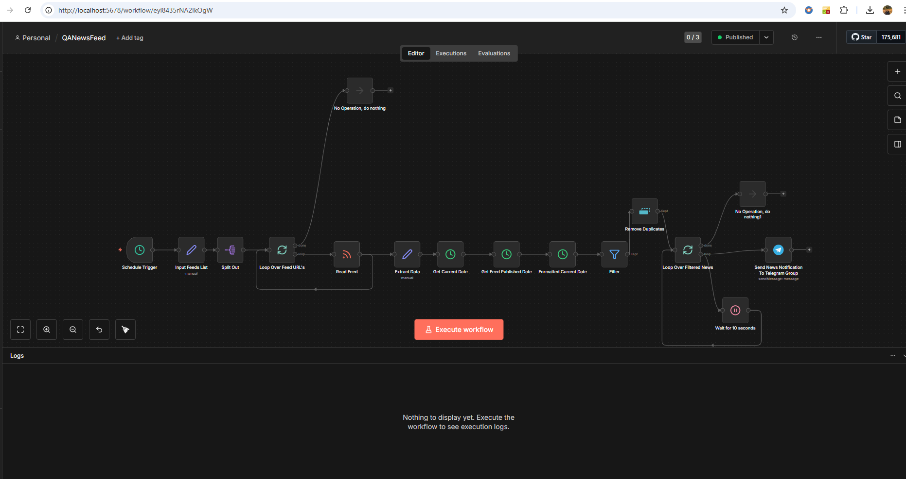
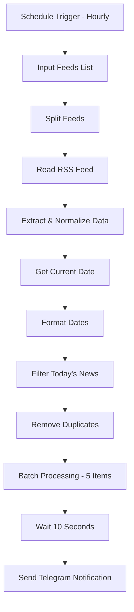

# 📡 QA News Real-Time Monitoring System (Self-Hosted n8n)

## 🚀 Project Overview

This project is a **self-hosted, event-driven QA News Intelligence System** built using **n8n**.

It automatically aggregates QA-related news from multiple RSS feeds, filters only today's articles, removes duplicates, applies batch processing with rate limiting, and sends structured updates to a Telegram group.

This project demonstrates production-grade workflow engineering, ETL-style data transformation, and API-safe notification handling.

---

## 🖼 Workflow Screenshot

Below is the actual n8n workflow implementation:

---

## 🧠 Problem Statement

QA Engineers need to stay updated with:

- Automation frameworks
- Testing tools
- DevOps trends
- Accessibility updates
- Industry best practices

Manually checking multiple websites daily is inefficient.

This system automates the entire process.

---

## ⚙️ Key Features

- ✅ Multi-source RSS aggregation  
- ✅ Data extraction and normalization (ETL style)  
- ✅ Dynamic publish date comparison (only today’s news)  
- ✅ Duplicate elimination across feeds  
- ✅ Batch processing (5 items per cycle)  
- ✅ Rate limiting (10-second delay between batches)  
- ✅ Structured Telegram notifications  
- ✅ Fully self-hosted architecture  

---

## 🏗 Architecture Diagram

---

## Live in Action
Download Telegram and Join https://t.me/QANewsFeeds for getting daily testing Updates   